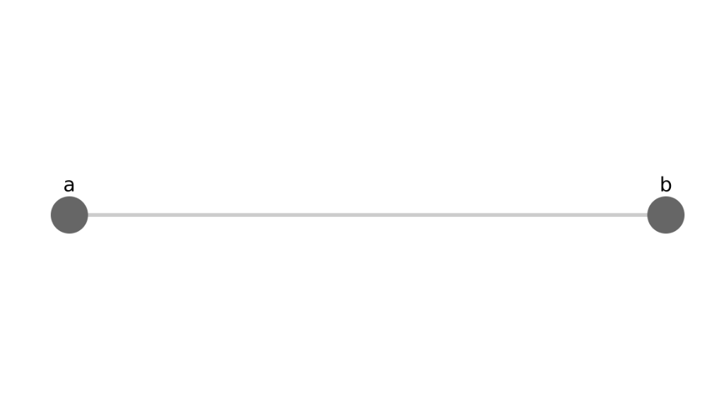
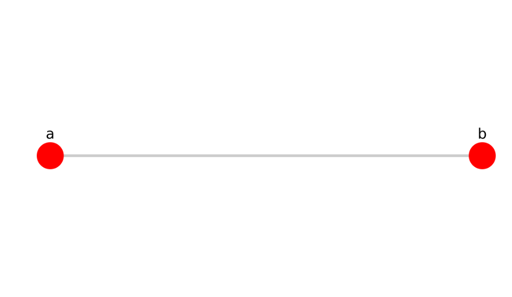
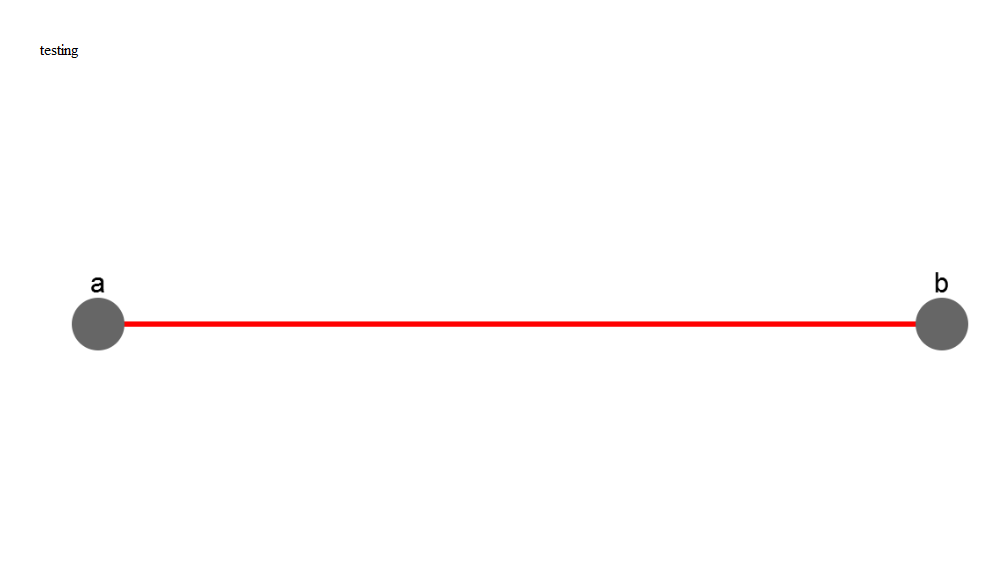
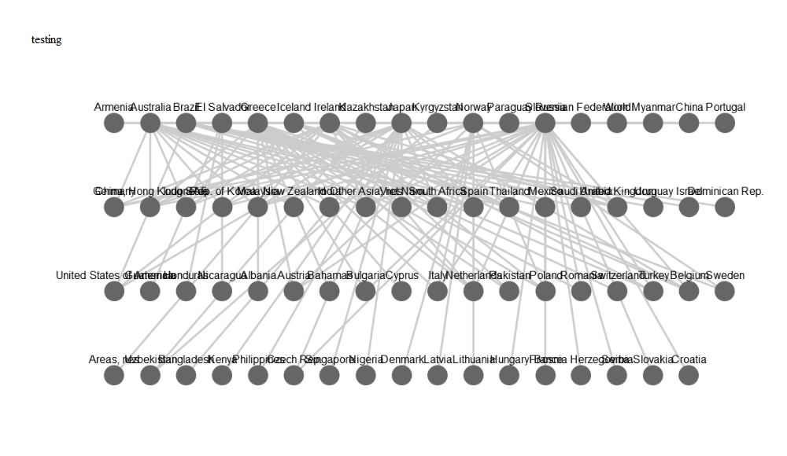
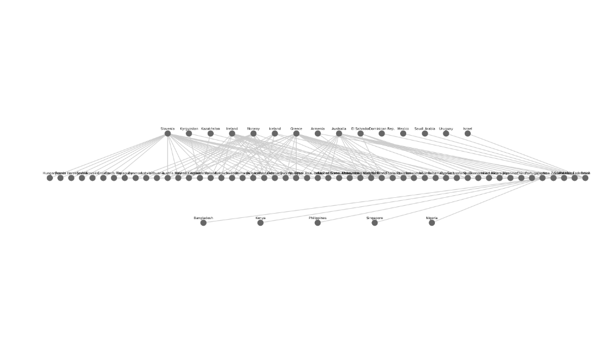
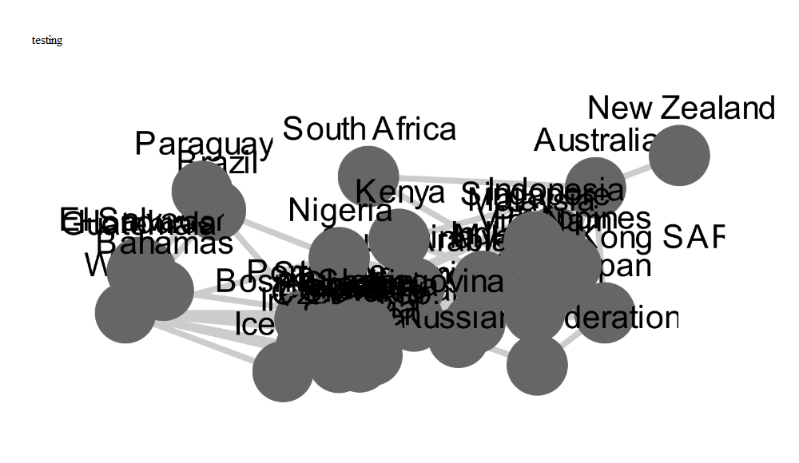

Cytoscape Network Charts
================

A HTMLWidget wrapper for the [Cytoscape.js](http://js.cytoscape.org/) graph / network visualisation and analysis library.

A Minimal Example
-----------------

``` r
nodes <- data.frame(id = c('a','b'))
edges <- data.frame(id = 'ab', source = 'a', target = 'b')

cytoscape(nodes = nodes, edges = edges) 
```



Styling Edges and Nodes
-----------------------

``` r
ct <- cytoscape(nodes = nodes, edges = edges)

ct %>% node_style('background-color' = '#ff0000')
```



``` r
ct %>% edge_style('line-color' = '#ff0000')
```



With Real Data
--------------

Comtrade waste plastic exports for December 2017.

``` r
df <- cytoscape::comtrade

nodes <- data.frame(id = unique(c(df$reporter, df$partner)), stringsAsFactors = FALSE)
edges <- df %>%
    dplyr::select(source = reporter,
                  target = partner) %>%
    dplyr::mutate(id = paste(source, '_', target))
```

    ## Warning: package 'bindrcpp' was built under R version 3.4.4

``` r
cytoscape(nodes = nodes, edges = edges) %>% 
  layout('grid', rows = 4)
```



``` r
cytoscape(nodes = nodes, edges = edges) %>% 
  layout('breadthfirst', directed = TRUE)
```



With Geographic Location
------------------------

``` r
# n_loc <- nodes %>%
#   dplyr::do(cbind(., ggmap::geocode(.$id)))

coords <- cytoscape::coords %>%
  rename(x = lon,
         y = lat) %>%
  filter(id != 'World') %>%
  mutate_at('y', funs(-.))
edges <- filter(edges, 
                source %in% coords$id,
                target %in% coords$id)

cytoscape(nodes = coords, edges = edges) %>% 
  layout('preset') %>%
  node_style(width = 3, height = 3, 'font-size' = 8) %>%
  edge_style(width = 1)
```


