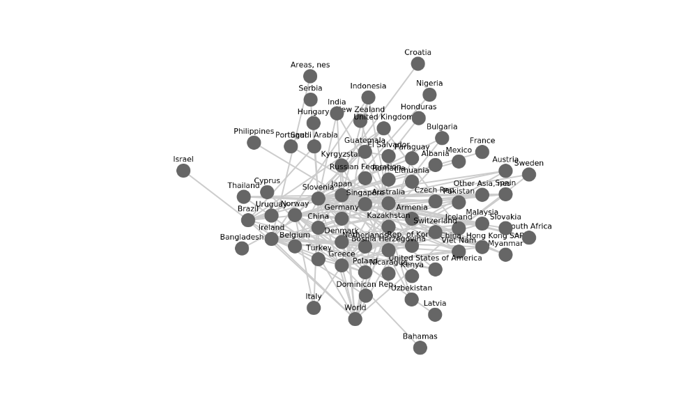
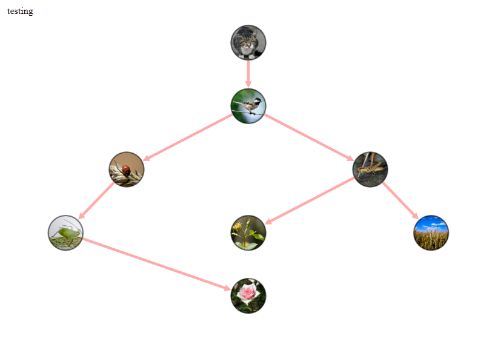

Cytoscape Network Charts
================

A HTMLWidget wrapper for the [Cytoscape.js](http://js.cytoscape.org/) graph / network visualisation and analysis library. There are already a number of existing `R` packages for Cytoscape such as the [Bioconductor package](https://bioconductor.org/packages/release/bioc/html/RCy3.html) and the official [Cytoscape Widget](https://github.com/cytoscape/r-cytoscape.js). The purpose of this package is to make the process of producing a chart as simple as possible.

A Minimal Example
-----------------

``` r
nodes <- data.frame(id = c('a','b'))
edges <- data.frame(id = 'ab', source = 'a', target = 'b')

cytoscape(nodes = nodes, edges = edges) 
```


Styling Edges and Nodes
-----------------------

``` r
ct <- cytoscape(nodes = nodes, edges = edges)

ct %>% node_style('background-color' = '#ff0000')
```


``` r
ct %>% edge_style('line-color' = '#ff0000')
```


With Real Data
--------------

Comtrade waste plastic exports for December 2017.

``` r
df <- cytoscape::comtrade

nodes <- data.frame(id = unique(c(df$reporter, df$partner)), stringsAsFactors = FALSE)
edges <- df %>%
    dplyr::select(source = reporter,
                  target = partner) %>%
    dplyr::mutate(id = paste(source, '_', target))
```

    ## Warning in combine_vars(vars, ind_list): '.Random.seed' is not an integer
    ## vector but of type 'NULL', so ignored

``` r
cytoscape(nodes = nodes, edges = edges) %>% 
  layout('grid', rows = 4)
```


``` r
cytoscape(nodes = nodes, edges = edges) %>% 
  layout('breadthfirst', directed = TRUE)
```


Cytoscape-Cola Layout
---------------------

Constraint based layouts provided through ([cola.js](http://ialab.it.monash.edu/webcola/)) can be used via the [cytoscape-cola plugin](https://github.com/cytoscape/cytoscape.js-cola). All options available in the plugin [API](https://github.com/cytoscape/cytoscape.js-cola#api) are available but have not yet been tested.

``` r
cytoscape(nodes = nodes, edges = edges) %>% 
  cola_layout()
```



With Geographic Location
------------------------

``` r
# n_loc <- nodes %>%
#   dplyr::do(cbind(., ggmap::geocode(.$id)))

coords <- cytoscape::coords %>%
  rename(x = lon,
         y = lat) %>%
  filter(id != 'World') %>%
  mutate_at('y', funs(-.))
edges <- filter(edges, 
                source %in% coords$id,
                target %in% coords$id)

cytoscape(nodes = coords, edges = edges) %>% 
  layout('preset') %>%
  node_style(width = 3, height = 3, 'font-size' = 8) %>%
  edge_style(width = 1)
```


Image Node Example
------------------

Replicate the `Cytograph.js` [images example](http://js.cytoscape.org/demos/images-breadthfirst-layout/). This example does not currently include the touch effects.

``` r
img_nodes <- data.frame(id = c('cat','bird','ladybug','aphid','rose','grasshopper','plant','wheat'),
                        images = c('https://farm2.staticflickr.com/1261/1413379559_412a540d29_b.jpg',
                                   'https://farm8.staticflickr.com/7272/7633179468_3e19e45a0c_b.jpg',
                                   'https://farm4.staticflickr.com/3063/2751740612_af11fb090b_b.jpg',
                                   'https://farm9.staticflickr.com/8316/8003798443_32d01257c8_b.jpg',
                                   'https://farm6.staticflickr.com/5109/5817854163_eaccd688f5_b.jpg',
                                   'https://farm7.staticflickr.com/6098/6224655456_f4c3c98589_b.jpg',
                                   'https://farm1.staticflickr.com/231/524893064_f49a4d1d10_z.jpg',
                                   'https://farm3.staticflickr.com/2660/3715569167_7e978e8319_b.jpg'),
                        stringsAsFactors = FALSE)
img_edges <- data.frame(source = c('cat','bird','bird','grasshopper','grasshopper','ladybug','aphid'),
                        target = c('bird','ladybug','grasshopper','plant','wheat','aphid','rose'),
                        stringsAsFactors = FALSE)

cytoscape(nodes = img_nodes,
          edges = img_edges) %>%
  layout(name = 'breadthfirst',
         directed = TRUE,
         padding = 10) %>%
  node_style('height' = 80,
             'width' = 80,
             'background-fit' = 'cover',
             'border-color' = '#000',
             'border-width' = 3,
             'border-opacity' = 0.5,
             'label' = NULL) %>%
  edge_style('curve-style' = 'bezier',
             'width' = 6,
             'target-arrow-shape' = 'triangle',
             'line-color' = '#ffaaaa',
             'target-arrow-color' = '#ffaaaa') %>%
  node_images()
```



Shiny Example
-------------

A minimal shiny example can be run from the `cytoscape` package of from `inst/shiny/minimum_shiny`

``` r

shiny::runApp(system.file('shiny/minimum_shiny', package = 'cytoscape'))
```

Pass JSON Object
----------------

If you already have a complete `JSON` this can be passed through directly as a character string. The `JSON` character is parsed in `javascript` using `JSON.parse()` so it is good practice to first test your `JSON` is properly formed. On the `R` side you can use `jsonlite::fromJSON()` or the web-service <http://json.parser.online.fr/> can sometimes give more meaningfull error messages.

``` r
json <- '{
"elements":[
    {
      "data": { "id": "a" } 
    },
    {
      "data": { "id": "b" }
    },
    {
      "data": { "id": "ab", "source": "a", "target": "b" }
    }
  ],

"style": [ 
  {
    "selector": "node",
    "style": {
      "background-color": "#666",
      "label": "data(id)"
    }
  },

  {
    "selector": "edge",
    "style": {
      "width": 3,
      "line-color": "#ccc",
      "target-arrow-color": "#ccc",
      "target-arrow-shape": "triangle"
    }
  }
],

"layout": {
  "name": "grid",
  "rows": 1
}
}'

cytoscape(json = json)
```


